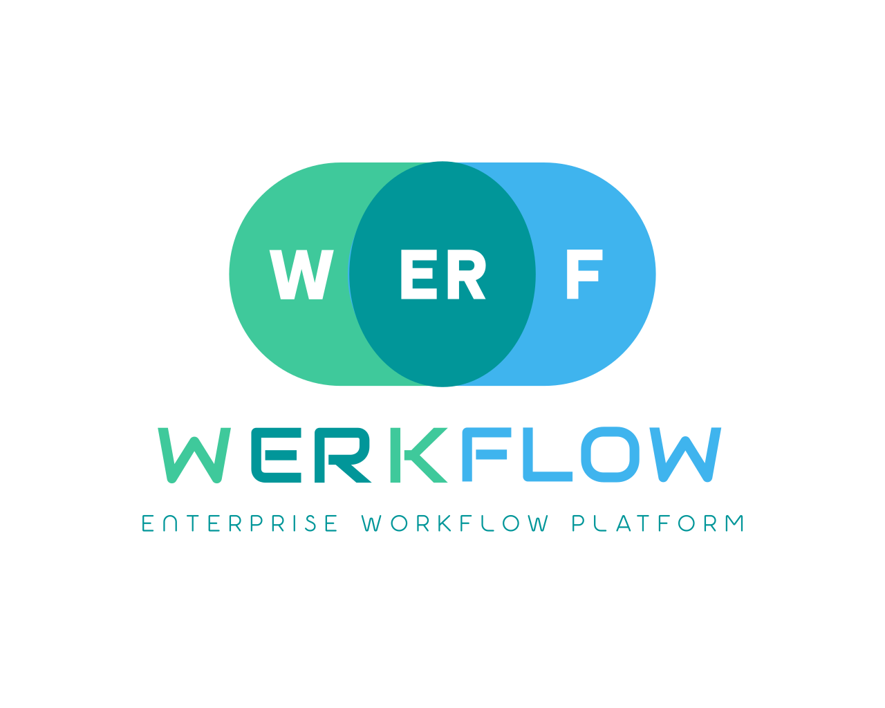

<p align="center">
  
</p>

<h1 align="center">Werkflow</h1>

<p align="center">
  Build and deploy approval flows with a visual BPMN designer and form builder — no code required.
</p>

<p align="center">
  <a href="./LICENSE"></a>
  
  
  
  
  <a href="./CONTRIBUTING.md"></a>
</p>

## Services

| Service    | Port | Description                                          |
|------------|------|------------------------------------------------------|
| Engine     | 8081 | Flowable BPM orchestration                           |
| Admin      | 8083 | User, organisation, and service registry management  |
| Portal     | 4000 | Web portal (Next.js)                                 |
| Keycloak   | 8090 | Authentication and authorisation                     |
| PostgreSQL | 5433 | Primary database                                     |
| Mailpit    | 8025 | Email sandbox (dev only — web UI to inspect sent emails) |

## Prerequisites

- Docker and Docker Compose
- Java 21+ (for local service development)
- Node.js 20+ (for local portal development)

## Quick Start

```bash
git clone https://github.com/themaverik/werkflow.git
cd werkflow/infrastructure/docker
docker compose up -d
```

> Env files are in `config/env/`. Copy `config/env/.env.*.example` files and fill in secrets before first run if they don't exist.

Portal available at http://localhost:4000

Engine API docs (Swagger UI) available at http://localhost:8081/swagger-ui.html

## Local Credentials

| Service        | URL                     | Username           | Password        |
|----------------|-------------------------|--------------------|-----------------|
| Portal (admin) | http://localhost:4000   | admin              | (see Keycloak)  |
| Keycloak admin | http://localhost:8090   | admin              | REDACTED_PASSWORD        |
| pgAdmin        | http://localhost:5050   | admin@werkflow.com | admin           |
| PostgreSQL     | localhost:5433          | werkflow_admin     | werkflow_secure_pass |

## Project Structure

```
werkflow/
├── services/
│   ├── engine/       # Flowable BPM orchestration (8081)
│   └── admin/        # Org and service registry management (8083)
├── frontends/
│   └── portal/       # Next.js portal (4000)
├── infrastructure/
│   └── docker/       # Docker Compose and Dockerfiles
└── docs/             # Architecture decisions, guides, ADRs
```

## Running Services Individually

### Backend services

Requires PostgreSQL and Keycloak running (via Docker Compose). See [Keycloak Setup](./docs/Keycloak-Implementation-Guide.md) for Keycloak configuration.

```bash
# Engine
cd services/engine && mvn spring-boot:run

# Admin
cd services/admin && mvn spring-boot:run
```

### Portal

```bash
cd frontends/portal
npm install
cp .env.local.example .env.local   # update KEYCLOAK_CLIENT_SECRET and NEXTAUTH_SECRET
npm run dev
```

## Roles

| Role            | Access                                     |
|-----------------|--------------------------------------------|
| `super_admin`   | Full platform access                       |
| `admin`         | Workflow designer, form builder, all tasks |
| `workflow_admin`| Workflow designer, form builder            |
| `employee`      | My Tasks, My Requests, Request Asset       |

Full role-to-DOA-level mappings: `services/engine/src/main/resources/application.yml`

## Email (SMTP)

In development, all emails are captured by [Mailpit](http://localhost:8025) — no real emails are sent.

**Dev**: Open http://localhost:8025 to inspect captured emails. No credentials required.

**Production**: Set the following vars in `config/env/.env.engine`:

| Variable | Description |
|----------|-------------|
| `SMTP_HOST` | SMTP server hostname |
| `SMTP_PORT` | SMTP port (typically 587 for STARTTLS) |
| `SMTP_USERNAME` | SMTP username or API key |
| `SMTP_PASSWORD` | SMTP password or API secret |
| `SMTP_AUTH` | Set to `true` |
| `SMTP_STARTTLS_ENABLE` | Set to `true` |
| `SMTP_STARTTLS_REQUIRED` | Set to `true` |
| `MAIL_FROM` | Sender address (e.g. `noreply@yourdomain.com`) |

## Example Processes

The engine auto-deploys example processes on startup from `services/engine/src/main/resources/processes/examples/`. All are at version 1.

| Category | Process | Description |
|----------|---------|-------------|
| Enterprise Cat1 | Procurement Approval | Multi-tier vendor selection + DMN-routed approval |
| Enterprise Cat1 | CapEx Approval | Capital expenditure request with DOA routing |
| Enterprise Cat1 | Finance Approval | Finance and budget approval workflow |
| Enterprise Cat2 | Leave Request | Employee leave application |
| Enterprise Cat2 | Event Ticket Request | Event attendance request |
| Enterprise Cat2 | General Approval | Generic DOA-routed approval (amount-gated) |
| Enterprise Cat2 | Onboarding Checklist | New hire onboarding tasks |
| Enterprise Cat2 | Asset Request | Hardware/asset procurement with signal correlation |

> Note: Engine Flyway is disabled (`FLYWAY_ENABLED:false`). If adding new DB migrations (V5+), apply them manually to the `flowable` schema via psql — Flowable manages its own schema tables.

## Documentation

- [Quick Start](./docs/QUICKSTART.md)
- [Connector Guide](./docs/CONNECTOR-GUIDE.md)
- [Connector Marketplace](http://localhost:4000/admin/marketplace) — install connectors from the portal (ADMIN role required)
- [Deployment Configuration](./docs/Deployment-Configuration-Guide.md)
- [Keycloak Setup](./docs/Keycloak-Implementation-Guide.md)
- [Architecture Decisions](./docs/Architecture/)

## License

Licensed under the [Apache License 2.0](./LICENSE). Third-party components (bpmn-js, form-js, dmn-js) are subject to the [bpmn.io license](./LICENSES/bpmn.io.txt). See [NOTICE](./NOTICE) for full attribution.
